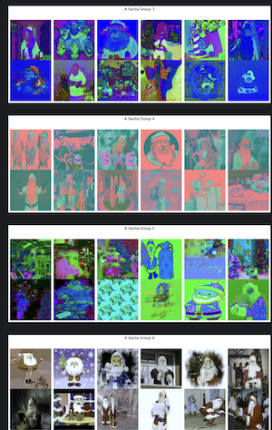
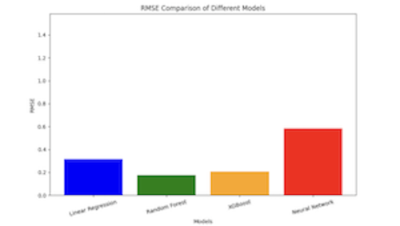
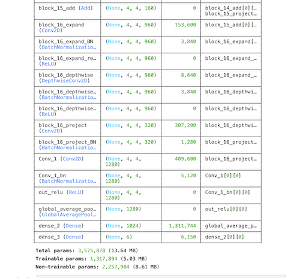
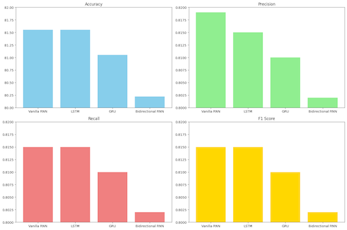
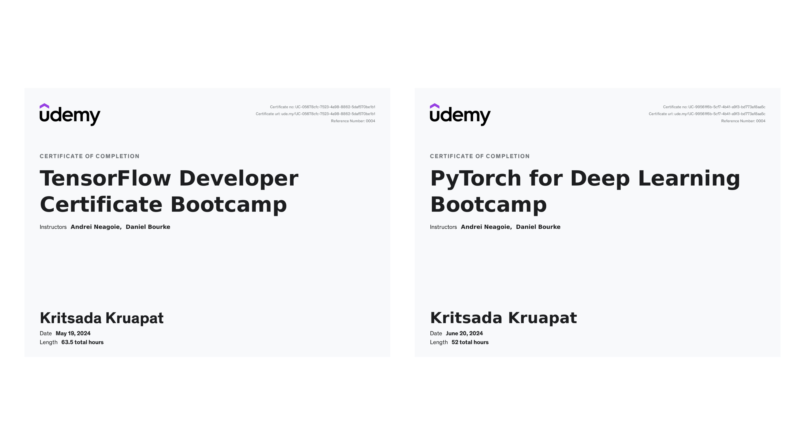

# Data Science Portfolio

Welcome to my Data Science portfolio! This repository showcases my work in optimizing performance metrics, fixing overfitting with data augmentation, comparing regression models, and utilizing transfer learning with ResNet-50 and etc.

# "This is highlighted notebook models from all my projects in kaggle:"

https://www.kaggle.com/kritsadakruapat

## Project 0: Machine learning without any library:
implementing and understanding various machine learning algorithms using Python.
https://github.com/kkowenn/ManualMachineLearning

## Project 1: Optimizing Performance Metrics

In this project, I focused on optimizing the values of performance metrics for a given model. The goal was to find the best possible combination of hyperparameters to achieve the highest performance. (before tuning vs after tuning)

https://github.com/kkowenn/DataSciencePortfilo/tree/main/Schooltask(WineQuality)

## Project 2: Data Augmentation to Fix Overfitting

Overfitting is a common problem in machine learning models. This project demonstrates how data augmentation techniques can help fix overfitting and improve model generalization. (model know if it's red, it will be santa for sure so I turn the santa image to be more colorful which fix overfiting)

https://www.kaggle.com/code/kritsadakruapat/cnnchangedatacolor-notjustred

## Project 3: Comparing Regression Models + Exploratory Data Analysis(EDA)

This project involves a comprehensive comparison of different regression models. The goal is to identify the best-performing model.

https://www.kaggle.com/code/kritsadakruapat/comparing-regression-models

## Project 4: Transfer Learning with ResNet-50

Transfer learning is a powerful technique in deep learning. This project showcases how ResNet-50, a pre-trained convolutional neural network, can be used for transfer learning to achieve high performance on a custom dataset.

https://www.kaggle.com/code/kritsadakruapat/simpletransferlearning-resnet50-unsatisfied

## Project 5 : RNN model (Vanilla RNN, LSTM, GRU, and Bidirectional RNN) 

The text describes building a text classification model. They cleaned data, converted text to numbers, and tried different model types (RNN) to see which performed best.

https://www.kaggle.com/code/kritsadakruapat/rnnmodelcomparison?scriptVersionId=182686891

## project 6 : Applying model on web:
This project is a web application that allows users to draw digits on a canvas and classify them using a pre-trained convolutional neural network (CNN) model. The model is trained on the MNIST dataset (not 100 % accuracy).
https://github.com/kkowenn/DigitRecognitionWeb

## acknowledgment & Udemy Certificate:
thank you so much, Andrei Neagoie and Daniel Bourke. It's the best course ever!!

